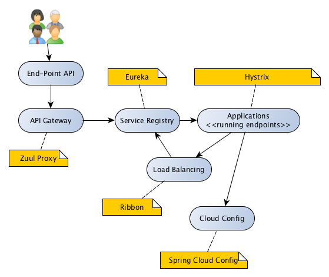

## maven-multi-example project

The project contains set of service modules (one, two) with additional shared libraries 
in order to demonstrate features offered by spring-cloud. 

##### Schema:
  

considered services: 
- Service discovery :: Eureka
- Reverse proxy, intelligent routingZuul :: reverse proxy, intelligent routing
- Circuit breaker pattern :: Hystrix
- Load balancing (client side) :: Ribbon
- Distributed/versioned configuration :: Spring Cloud Config

### requirements
project uses Maven build system and Java 11. 
Java version can be downgraded to 1.8

### how to run
you can import the whole project into your 
favorite IDE and execute all from there.

The project contains following micro-services:
- example-app-one (port: 8081)
- example-app-two (port: 8082)
- example-eureka (port: 8761)
- example-config-server (port: 8090)

All micro-services are spring-boot based

to compile the project use the following command:
```bash
$ ./mvnw clean package
```

to run individual micro-service use following command:
```bash
$ ./mvnw -pl <service-name> spring-boot:run
```

